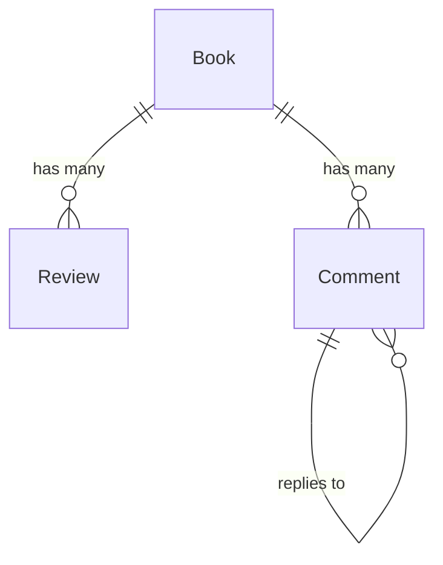
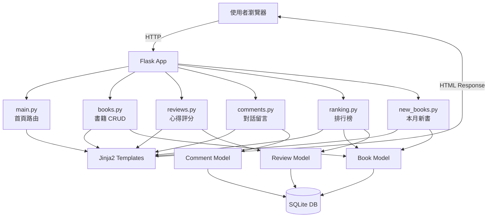

# 系統架構設計 — 讀書筆記本系統

## 1. 架構概述

本系統採用 **MVC（Model-View-Controller）** 架構模式，以 Flask 為後端框架，Jinja2 為模板引擎（View），SQLite 為資料庫。系統為單體應用（Monolithic），適合中小規模的讀書筆記管理需求。

```
┌─────────────────────────────────────────────────────┐
│                     使用者瀏覽器                      │
│               (HTML + CSS + JavaScript)              │
└───────────────────────┬─────────────────────────────┘
                        │ HTTP Request / Response
                        ▼
┌─────────────────────────────────────────────────────┐
│                   Flask 應用程式                      │
│  ┌─────────────┐  ┌──────────────┐  ┌────────────┐  │
│  │  Controller  │  │    View      │  │   Model    │  │
│  │  (Routes)    │→ │  (Jinja2     │  │  (SQLite   │  │
│  │  app/routes/ │  │   Templates) │  │   ORM)     │  │
│  └──────┬───────┘  └──────────────┘  └─────┬──────┘  │
│         │                                   │        │
│         └───────────────────────────────────┘        │
└─────────────────────────────────────────────────────┘
                        │
                        ▼
              ┌───────────────────┐
              │   SQLite 資料庫    │
              │   (booknotes.db)  │
              └───────────────────┘
```

---

## 2. 技術棧詳細說明

| 層級       | 技術              | 版本建議   | 用途                          |
| ---------- | ----------------- | ---------- | ----------------------------- |
| 前端模板   | Jinja2            | Flask 內建 | HTML 頁面渲染                 |
| 前端樣式   | CSS               | CSS3       | 頁面佈局與視覺設計            |
| 前端互動   | JavaScript        | ES6+       | 搜尋即時回饋、星星評分互動    |
| 後端框架   | Flask             | 3.x        | 路由處理、請求回應            |
| 資料庫     | SQLite            | 3.x        | 資料持久化儲存                |
| ORM        | Flask-SQLAlchemy  | 3.x        | 資料庫物件關聯映射            |
| 表單驗證   | Flask-WTF         | 1.x        | 表單驗證與 CSRF 保護          |
| 環境管理   | python-dotenv     | 1.x        | 環境變數管理                  |

---

## 3. 專案資料夾結構

```
web_app_development/
├── app/                        # 應用程式主目錄
│   ├── __init__.py             # Flask 應用工廠（App Factory）
│   ├── config.py               # 設定檔（資料庫路徑、密鑰等）
│   ├── models/                 # Model 層 — 資料模型
│   │   ├── __init__.py
│   │   ├── book.py             # 書籍模型（Book）
│   │   ├── review.py           # 心得與評分模型（Review）
│   │   └── comment.py          # 詢問對話框留言模型（Comment）
│   ├── routes/                 # Controller 層 — 路由處理
│   │   ├── __init__.py
│   │   ├── main.py             # 首頁路由（/）
│   │   ├── books.py            # 書籍 CRUD 路由（/books/*）
│   │   ├── reviews.py          # 心得與評分路由
│   │   ├── comments.py         # 留言對話路由
│   │   ├── ranking.py          # 推薦排行榜路由（/ranking）
│   │   └── new_books.py        # 本月新書路由（/new-books）
│   ├── templates/              # View 層 — Jinja2 HTML 模板
│   │   ├── base.html           # 基底模板（共用導覽列、頁尾）
│   │   ├── index.html          # 首頁
│   │   ├── books/
│   │   │   ├── list.html       # 書籍列表頁
│   │   │   ├── detail.html     # 書籍詳細頁（含心得 + 對話框）
│   │   │   ├── create.html     # 新增書籍表單
│   │   │   └── edit.html       # 編輯書籍表單
│   │   ├── ranking.html        # 推薦排行榜頁
│   │   └── new_books.html      # 本月新書頁
│   └── static/                 # 靜態檔案
│       ├── css/
│       │   └── style.css       # 全站樣式
│       ├── js/
│       │   └── main.js         # 前端互動邏輯
│       └── images/             # 圖片資源
├── database/
│   └── schema.sql              # 資料庫建表 SQL
├── docs/                       # 設計文件
│   ├── PRD.md                  # 產品需求文件
│   ├── ARCHITECTURE.md         # 系統架構文件（本文件）
│   ├── FLOWCHART.md            # 流程圖
│   ├── DB_DESIGN.md            # 資料庫設計
│   └── ROUTES.md               # 路由設計
├── .env                        # 環境變數（不進版控）
├── .gitignore                  # Git 忽略清單
├── requirements.txt            # Python 套件相依
├── run.py                      # 應用程式進入點
└── README.md                   # 專案說明
```

---

## 4. MVC 架構說明

### 4.1 Model（資料模型層）

負責定義資料結構與資料庫互動邏輯。

| 模型      | 檔案                  | 對應資料表  | 說明                     |
| --------- | --------------------- | ----------- | ------------------------ |
| Book      | `app/models/book.py`    | `books`     | 書籍資訊（書名、作者等） |
| Review    | `app/models/review.py`  | `reviews`   | 心得與評分               |
| Comment   | `app/models/comment.py` | `comments`  | 對話框留言               |

**模型關聯：**



- 一本書（Book）可以有多篇心得（Review）
- 一本書（Book）可以有多則留言（Comment）
- 留言（Comment）可以回覆另一則留言（自關聯）

### 4.2 View（視圖層）

使用 Jinja2 模板引擎渲染 HTML 頁面。

| 模板                        | 對應頁面       | 說明                     |
| --------------------------- | -------------- | ------------------------ |
| `base.html`                 | —              | 基底版面（Navbar + Footer） |
| `index.html`                | 首頁           | 排行榜摘要 + 本月新書摘要  |
| `books/list.html`           | 書籍列表       | 書籍卡片 + 搜尋列          |
| `books/detail.html`         | 書籍詳細頁     | 書籍資訊 + 心得 + 留言      |
| `books/create.html`         | 新增書籍       | 表單                       |
| `books/edit.html`           | 編輯書籍       | 表單（預填資料）            |
| `ranking.html`              | 推薦排行榜     | 排行表格                    |
| `new_books.html`            | 本月新書       | 書籍卡片列表                |

**模板繼承結構：**

```
base.html
├── index.html
├── books/list.html
├── books/detail.html
├── books/create.html
├── books/edit.html
├── ranking.html
└── new_books.html
```

### 4.3 Controller（控制器層）

Flask 路由函式負責接收請求、呼叫 Model、傳遞資料給 View。

| 路由模組       | 檔案                      | 負責功能                 |
| -------------- | ------------------------- | ------------------------ |
| main_bp        | `app/routes/main.py`       | 首頁顯示                 |
| books_bp       | `app/routes/books.py`      | 書籍 CRUD + 搜尋         |
| reviews_bp     | `app/routes/reviews.py`    | 心得新增與瀏覽           |
| comments_bp    | `app/routes/comments.py`   | 留言新增與瀏覽           |
| ranking_bp     | `app/routes/ranking.py`    | 排行榜查詢               |
| new_books_bp   | `app/routes/new_books.py`  | 本月新書查詢             |

---

## 5. 請求處理流程

```
使用者操作瀏覽器
       │
       ▼
  HTTP Request（GET/POST）
       │
       ▼
  Flask 路由匹配（Controller）
       │
       ├─→ 讀取/寫入資料（Model ↔ SQLite）
       │
       ▼
  Jinja2 模板渲染（View）
       │
       ▼
  HTTP Response（HTML 頁面）
       │
       ▼
  使用者瀏覽器顯示結果
```

### 範例：新增書籍流程

```
1. 使用者訪問 GET /books/new     → books.py 回傳 create.html 表單
2. 使用者填寫表單並送出           → POST /books/new
3. books.py 接收表單資料          → 驗證欄位
4. 呼叫 Book Model 建立新記錄    → 寫入 SQLite
5. 重導向至 GET /books/<id>      → 顯示新書籍的詳細頁
```

---

## 6. Flask 應用工廠模式

使用 **Application Factory** 模式建立 Flask 應用，方便測試與擴充：

```python
# app/__init__.py

from flask import Flask
from flask_sqlalchemy import SQLAlchemy

db = SQLAlchemy()

def create_app():
    app = Flask(__name__)
    app.config.from_object('app.config.Config')

    # 初始化資料庫
    db.init_app(app)

    # 註冊 Blueprint（路由模組）
    from app.routes.main import main_bp
    from app.routes.books import books_bp
    from app.routes.reviews import reviews_bp
    from app.routes.comments import comments_bp
    from app.routes.ranking import ranking_bp
    from app.routes.new_books import new_books_bp

    app.register_blueprint(main_bp)
    app.register_blueprint(books_bp)
    app.register_blueprint(reviews_bp)
    app.register_blueprint(comments_bp)
    app.register_blueprint(ranking_bp)
    app.register_blueprint(new_books_bp)

    # 建立資料表
    with app.app_context():
        db.create_all()

    return app
```

---

## 7. 設定檔

```python
# app/config.py

import os

basedir = os.path.abspath(os.path.dirname(__file__))

class Config:
    SECRET_KEY = os.environ.get('SECRET_KEY', 'dev-secret-key')
    SQLALCHEMY_DATABASE_URI = 'sqlite:///' + os.path.join(
        os.path.dirname(basedir), 'database', 'booknotes.db'
    )
    SQLALCHEMY_TRACK_MODIFICATIONS = False
```

---

## 8. 關鍵設計決策

| 決策項目                | 選擇              | 理由                                     |
| ----------------------- | ----------------- | ---------------------------------------- |
| 架構模式                | MVC               | 職責清晰分離，適合 Flask 專案            |
| 應用初始化              | App Factory       | 便於測試、設定切換、模組化管理           |
| 路由組織                | Blueprint         | 各功能模組獨立，團隊可分工開發           |
| ORM                     | Flask-SQLAlchemy  | 簡化資料庫操作，避免手寫 SQL             |
| 資料庫                  | SQLite            | 輕量、無需安裝，適合教學與小型專案       |
| 模板引擎                | Jinja2            | Flask 內建，支援模板繼承與巨集           |
| CSS 架構                | 單一 style.css    | 專案規模適中，單檔管理即可               |

---

## 9. 相依套件（requirements.txt）

```
Flask>=3.0
Flask-SQLAlchemy>=3.1
Flask-WTF>=1.2
python-dotenv>=1.0
```

---

## 10. 元件互動總覽


