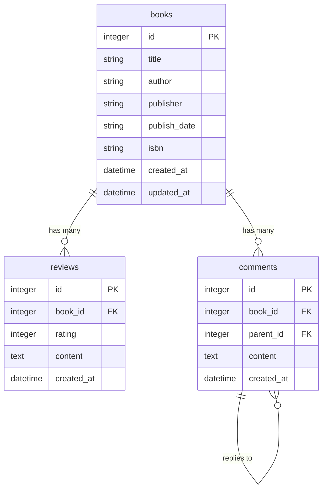

# 資料庫設計文件 (DB Design)

## 1. ER 圖（實體關係圖）

## 2. 資料表詳細說明

### 2.1 books (書籍表)

儲存書籍的基本資訊。

| 欄位名稱 | 型別 | 必填 | 預設值 | 說明 |
| --- | --- | --- | --- | --- |
| `id` | INTEGER | 是 | AUTOINCREMENT | Primary Key |
| `title` | TEXT | 是 | 無 | 書名 |
| `author` | TEXT | 否 | NULL | 作者 |
| `publisher` | TEXT | 否 | NULL | 出版社 |
| `publish_date` | TEXT | 否 | NULL | 出版日期 |
| `isbn` | TEXT | 否 | NULL | ISBN 編號 |
| `created_at` | DATETIME | 是 | CURRENT_TIMESTAMP | 建立時間 |
| `updated_at` | DATETIME | 是 | CURRENT_TIMESTAMP | 最後更新時間 |

### 2.2 reviews (心得評分表)

儲存使用者對書籍的心得評論與評分。

| 欄位名稱 | 型別 | 必填 | 預設值 | 說明 |
| --- | --- | --- | --- | --- |
| `id` | INTEGER | 是 | AUTOINCREMENT | Primary Key |
| `book_id` | INTEGER | 是 | 無 | Foreign Key (關聯 books.id) |
| `rating` | INTEGER | 是 | 無 | 評分 (1~5) |
| `content` | TEXT | 是 | 無 | 心得內容 |
| `created_at` | DATETIME | 是 | CURRENT_TIMESTAMP | 建立時間 |

### 2.3 comments (留言對話表)

儲存書籍的詢問對話及回覆。

| 欄位名稱 | 型別 | 必填 | 預設值 | 說明 |
| --- | --- | --- | --- | --- |
| `id` | INTEGER | 是 | AUTOINCREMENT | Primary Key |
| `book_id` | INTEGER | 是 | 無 | Foreign Key (關聯 books.id) |
| `parent_id` | INTEGER | 否 | NULL | Foreign Key (關聯 comments.id，用於回覆) |
| `content` | TEXT | 是 | 無 | 留言內容 |
| `created_at` | DATETIME | 是 | CURRENT_TIMESTAMP | 建立時間 |

## 3. SQL 建表語法

請參考 `database/schema.sql` 檔案。

## 4. Python Model 程式碼

根據系統架構設計文件，本專案採用 **Flask-SQLAlchemy** 作為 ORM 框架，對應的 Model 分佈在 `app/models/` 目錄中：
- `app/models/book.py`
- `app/models/review.py`
- `app/models/comment.py`
