# 流程圖設計 — 讀書筆記本系統

## 1. 系統總覽流程圖

使用者進入系統後的整體導覽流程：

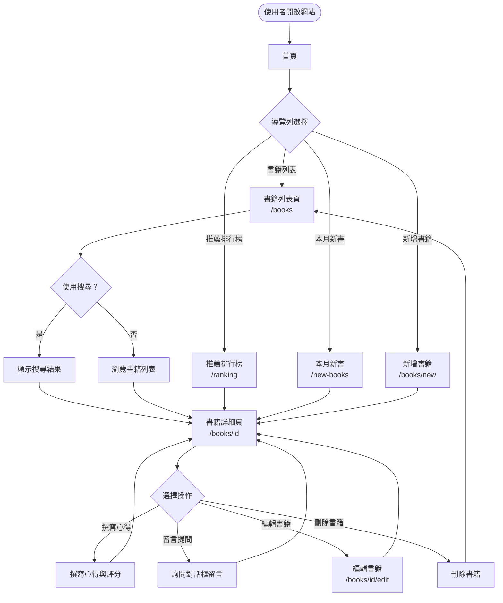

---

## 2. 功能流程圖

### 2.1 F1：記錄書名（書籍 CRUD）

#### 新增書籍

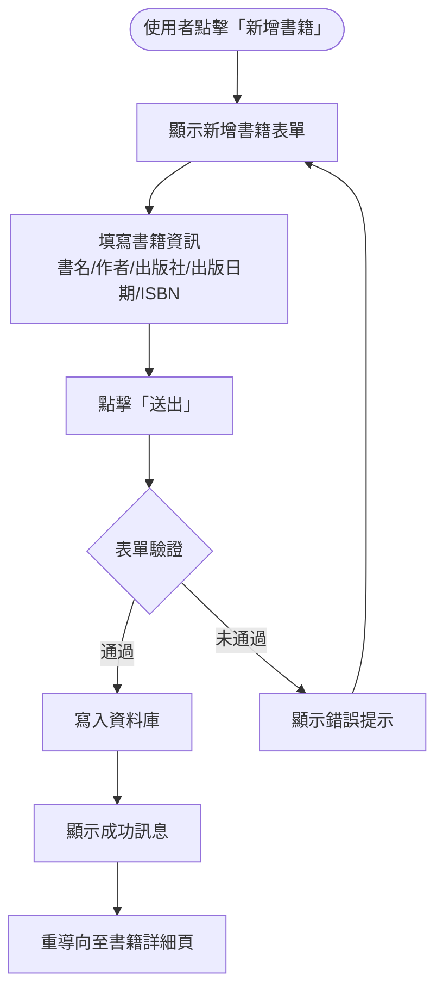

#### 編輯書籍

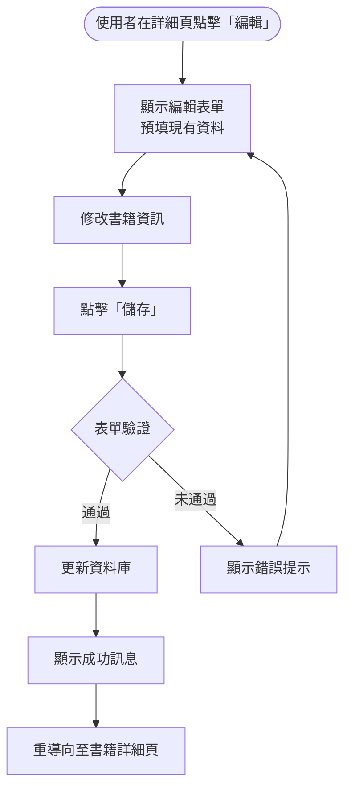

#### 刪除書籍

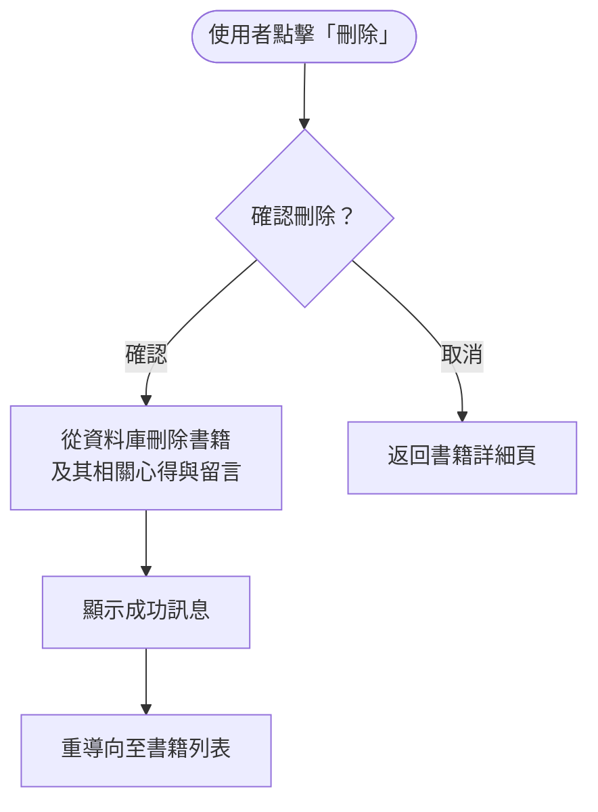

---

### 2.2 F2：詢問對話框

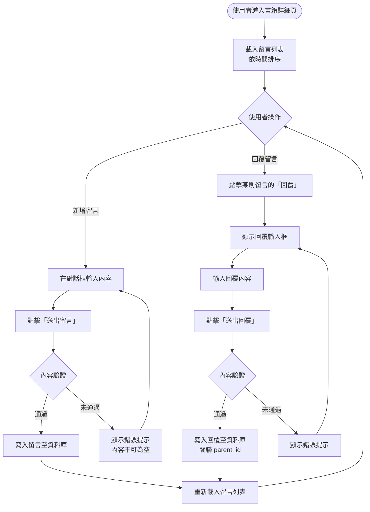

---

### 2.3 F3：心得與評分

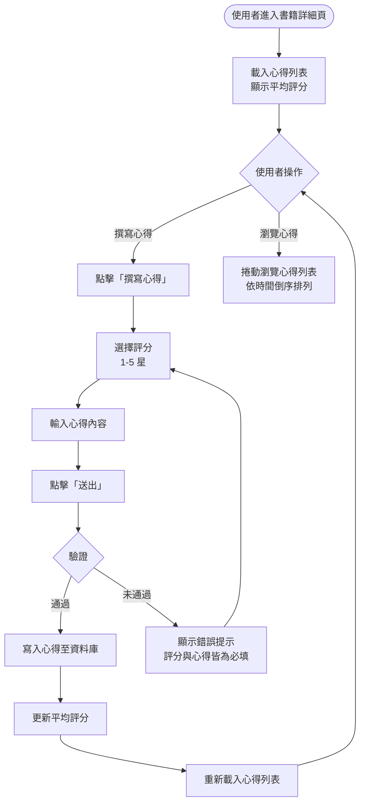

---

### 2.4 F4：推薦書籍排行榜

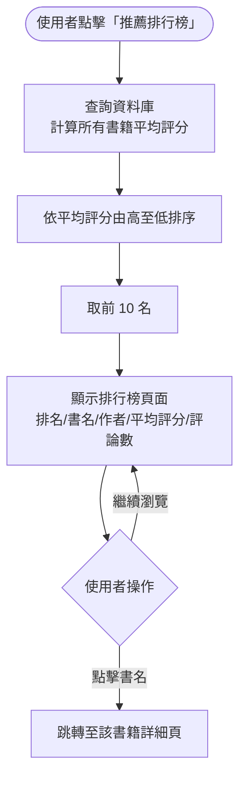

---

### 2.5 F5：本月新書

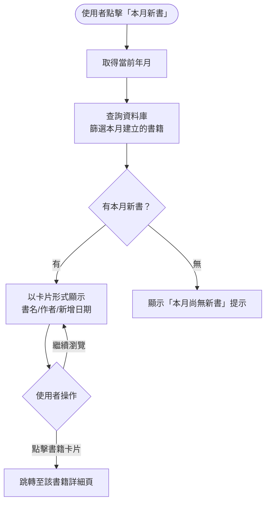

---

### 2.6 F6：書籍搜尋

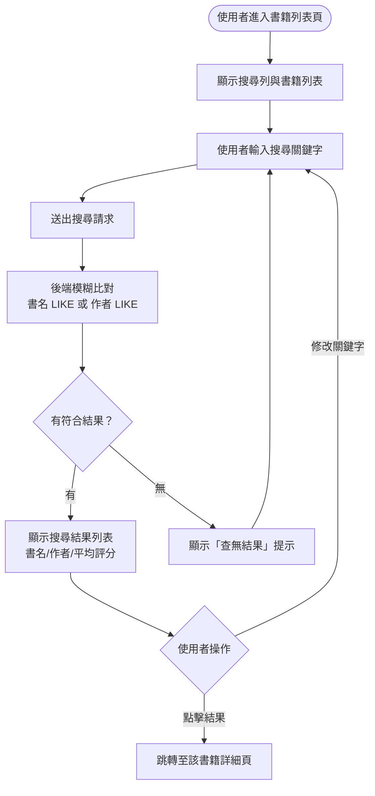

---

## 3. 頁面導覽流程圖

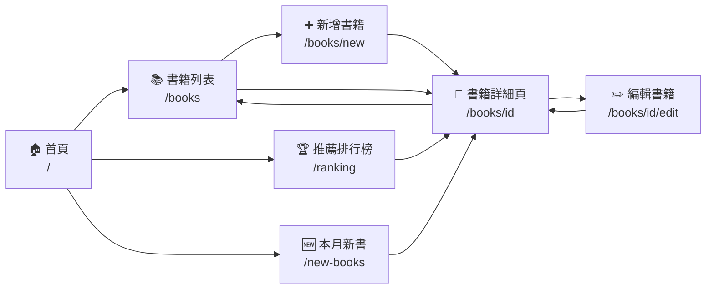

---

## 4. 資料流向圖

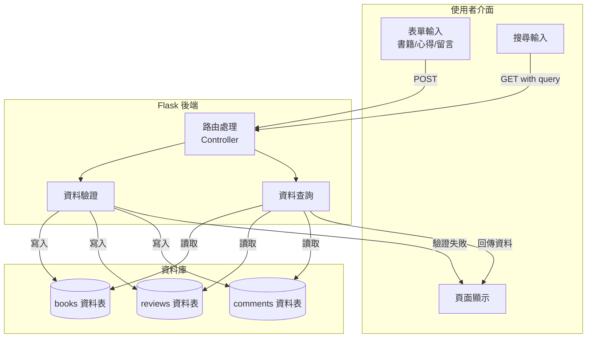
